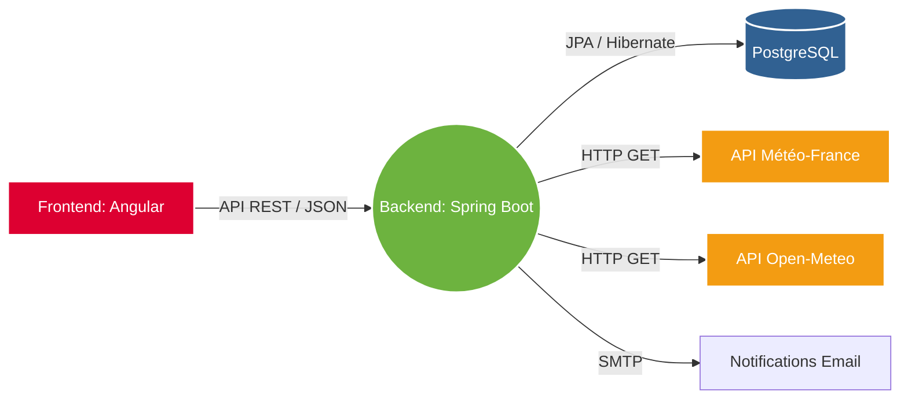

<div align="center">
  <h1>🌍 DacAlerte (D@cAlerte)</h1>
  <p><strong>Système centralisé de gestion et de notification des alertes météorologiques.</strong></p>
  
  <p>
    
    
    
    
  </p>
</div>

---

## 📖 Table des Matières
- [À propos du projet](#-à-propos-du-projet)
- [Fonctionnalités Principales](#-fonctionnalités-principales)
- [Architecture Technique](#-architecture-technique)
- [Modèle de Données](#-modèle-de-données)
- [Prérequis et Installation](#-prérequis-et-installation)
- [Auteur](#-auteur)

---

## 🎯 À propos du projet

DacAlerte est une application web conçue pour gérer proactivement l'ensemble des alertes météorologiques sur les différents sites couverts par **Dalkia** (groupe EDF). 

Réalisée dans le cadre d'un stage de BUT Informatique 2ème année au sein de l'**Équipe Pi**, cette application pilote répond aux contraintes réglementaires de mise en place de systèmes d'alerte environnementale. Elle collecte de manière autonome les données de l'API Météo-France et d'Open-Meteo pour notifier rapidement les responsables de sites en cas de vigilance extrême.

---

## ✨ Fonctionnalités Principales

- 🗺️ **Cartographie Interactive** : Visualisation en temps réel des sites sous surveillance et des zones en alerte (Départements) via *MapLibre GL JS* et l'analyse spatiale de *Turf.js*.
- 🔄 **Collecte Automatisée** : Tâches de fond dynamiques (CRON) pour interroger quotidiennement les API **Météo-France** (Vigilance) et **Open-Meteo** (Prévisions détaillées).
- 📩 **Système de Notification** : Envoi d'e-mails automatisés (contenant un récapitulatif et des conseils de prévention, ex: "en cas de canicule, veuillez vous abriter") aux ressources (techniciens et responsables de sites).
- ⚙️ **Administration Complète** : Interfaces responsives (Angular Material) permettant aux administrateurs de gérer les utilisateurs et la planification des envois, avec la possibilité de déclencher manuellement les envois.
- 🔐 **Sécurité** : Authentification par token et Google Login OAuth2.

---

## 🏗 Architecture Technique

L'architecture s'appuie sur une séparation stricte entre le Frontend (SPA) et le Backend (API REST). Le déploiement s'appuie sur une infrastructure conteneurisée.



* **Frontend** : Angular, MapLibre GL JS, Turf.js, Angular Material.
* **Backend** : Java 17+, Spring Boot, Spring Security, Spring Data JPA, JavaMail.
* **Infrastructure** : Docker, Docker Compose, Proxy Nginx.

---

## 📊 Modèle de Données

Le système relationnel gère les principales entités métier suivantes :
* **Ressource** : Profils de contact (DKCode, emails, téléphones) assignables à des ordre de travails.
* **Ordre de travail** : Intervention sur un site, assignables à un Site.
* **Département & Site** : Pivot géographique. Un Site appartient à un Département.
* **Bulletin, Alerte & Daily_meteo** : Données météorologiques et niveaux de vigilance associées à un jour et un secteur géographique (département).

---

## 🚀 Prérequis et Installation

### Prérequis
- [Docker](https://docs.docker.com/get-docker/) et [Docker Compose](https://docs.docker.com/compose/install/) installés.
- (Optionnel pour dev) Java 17+ / Maven et Node.js v18+.

### Déploiement Conteneurisé (Production / Test)
L'application est prévue pour être déployée via une stack Docker :

1. Clonez ce dépôt sur la machine d'hébergement.
2. Configurez les variables d'environnement (`.env`) contenant les informations sensibles (identifiants SMTP, clés Google OAuth2, mots de passe PostgreSQL).
3. Lancez les conteneurs :
```bash
docker-compose up -d --build
```
4. L'application devrait être disponible via votre Nginx Proxy Manager (généralement exposé sur les ports `80` et `443` pour le SSL).

---

## 👨‍💻 Auteur

**Antoine FERRERO**
*Étudiant en BUT Informatique (2ème année)*

Un grand remerciement à l'**Équipe Pi** de Dalkia pour leur encadrement tout au long du développement.
